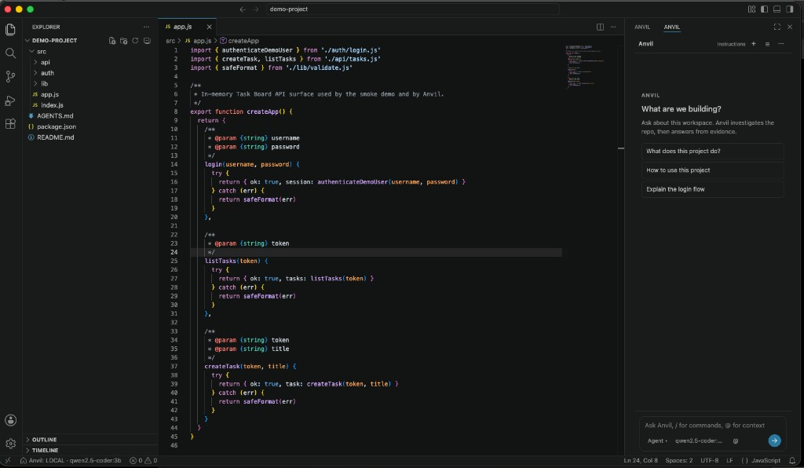
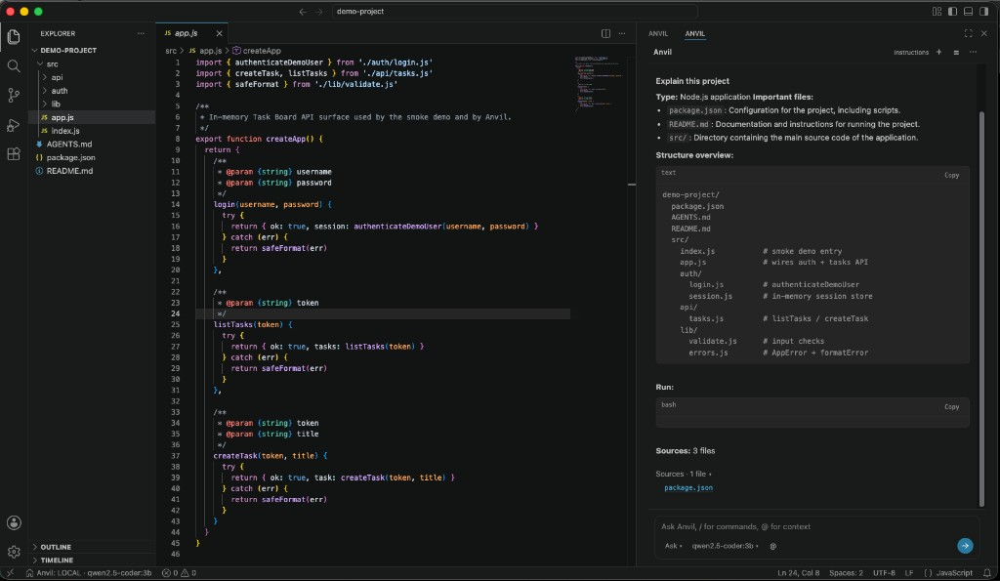
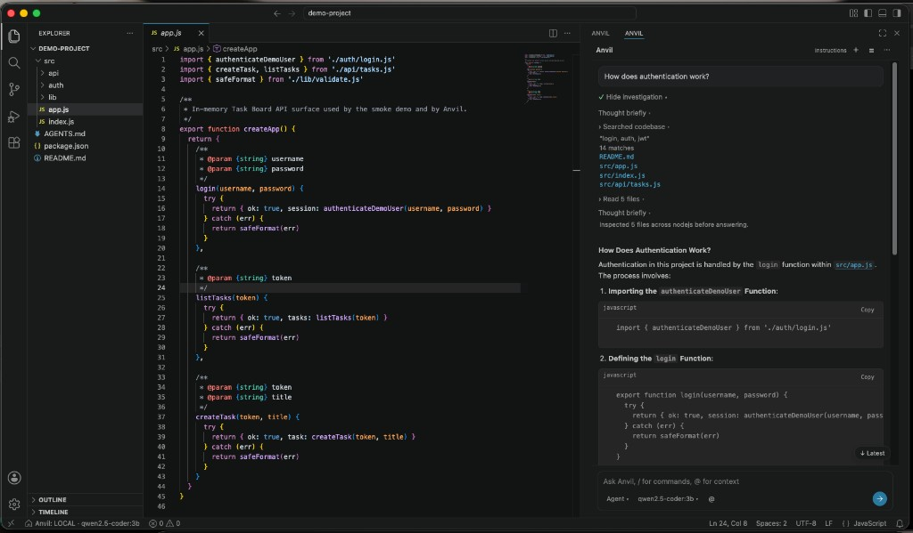
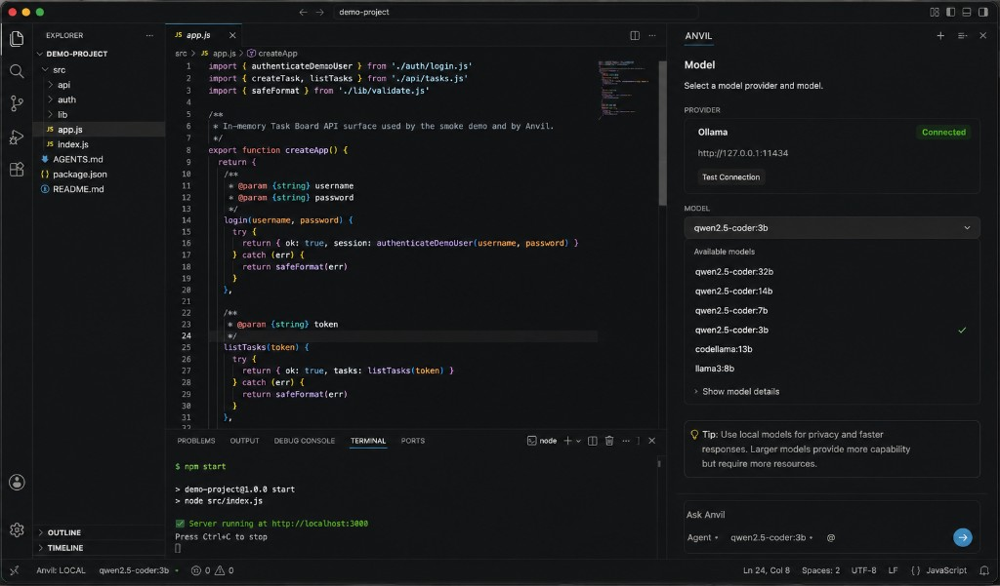

# Anvil

[](https://github.com/pranee54/Anvil/actions/workflows/ci.yml)
[](LICENSE)
[](CHANGELOG.md)
[](docs/INSTALL-MACOS.md)
[](CHANGELOG.md)

A local-first AI coding IDE built on the Code-OSS / VSCodium ecosystem with **Anvil Agent**.

Primary AI path: **Ollama** + local coding models (models are installed separately; Anvil does not bundle them).

> **Developer preview (v0.2.0)** — usable for local AI-assisted coding. There is currently **no official prebuilt binary download**.

| Platform | What works today |
|----------|------------------|
| **macOS** | Desktop packaging via `npm run anvil:package:mac` (build from source). Builds are **ad-hoc / unsigned** — Gatekeeper may require **right-click → Open**. |
| **Windows** | Development only: build packages + run Anvil Agent in an Extension Development Host. **No standalone Windows app** yet. |
| **Linux** | Not verified — planned. |

## Screenshots

### Anvil IDE

Full coding workspace with the Anvil assistant.



### Ask Mode

Repository-aware answers grounded in project files.



### Agent Mode

Anvil investigates the codebase and traces implementation across files.



### Local AI

Select and run local Ollama coding models such as `qwen2.5-coder:3b`.



## Quick Start

### macOS (desktop app, build from source)

```bash
git clone https://github.com/pranee54/Anvil.git
cd Anvil
npm install
```

Install [Ollama](https://ollama.com), then:

```bash
ollama pull qwen2.5-coder:3b
ollama list
```

Package and launch Anvil:

```bash
npm run anvil:package:mac
open dist/Anvil.app
```

If macOS blocks the app: Finder → right-click `Anvil.app` → **Open**. Details: [docs/INSTALL-MACOS.md](docs/INSTALL-MACOS.md).

Then:

1. **File → Open Folder…** and select [`demo-project/`](demo-project/)
2. Status bar → select **Ollama** / `qwen2.5-coder:3b` (or **Anvil: Select Model**)
3. **Anvil: Test Ollama Connection**
4. Open **Anvil Chat** (`Cmd+L`)
5. Ask: `Explain this codebase.`

### Windows (development only)

There is no packaged Windows application yet. Build the agent packages and run them in an Extension Development Host — see [docs/INSTALL-WINDOWS.md](docs/INSTALL-WINDOWS.md).

## What is Anvil?

- Code-OSS-class desktop IDE (editor, terminal, Git, search, Open VSX extensions)
- Built-in **Anvil Agent** and **Anvil Chat**
- Local-first AI via Ollama
- Repository investigation (search, read, project structure)
- **Ask**, **Edit**, and **Agent** modes
- `@` context: `@file` `@selection` `@folder` `@codebase` `@problems` `@git`
- File edits with native diff review
- Terminal / tool execution with a permission policy
- Task checkpoints and revert
- Streaming responses when using **Ollama**

## Features

Verified in this release:

- Ask / Edit / Agent workflows
- **Ollama** (local, streaming)
- **OpenAI-compatible** HTTP providers (implemented; responses are **not** streamed)
- Repository investigation and answer grounding from project files
- Diff review (Accept / Reject) and checkpoints / revert
- Diagnostics-aware commands (e.g. Fix Problems)
- Conversation sessions
- macOS packaged application (`dist/Anvil.app` after local build)

Not enabled yet (scaffolded for future work only):

- Anthropic provider
- Gemini provider

## Local AI

Anvil does **not** ship Ollama or model weights.

1. Install Ollama ([guide](docs/LOCAL-AI.md))
2. Pull a coding model, e.g. `ollama pull qwen2.5-coder:3b` or `qwen2.5-coder:7b`
3. Connect Anvil to `http://127.0.0.1:11434`

## Modes

| Mode | Behavior |
|------|----------|
| **Ask** | Explain and investigate without intentionally editing the project |
| **Edit** | Focused code changes with review |
| **Agent** | Multi-step tasks using repository tools (files, search, terminal, git, …) |

Risky operations follow `anvil.permissionMode`: `strict`, `ask` (default), or `permissive`. See [docs/USAGE.md](docs/USAGE.md).

## Platform Support

| Platform | Development | Packaged app | Status |
|----------|-------------|--------------|--------|
| macOS | Supported | Build from source (`anvil:package:mac`) | Supported + tested |
| Windows | Supported (Extension Development Host) | Not available | Development only |
| Linux | Untested | Not available | Planned |

## Installation

- **[macOS](docs/INSTALL-MACOS.md)** — build `Anvil.app`; Gatekeeper for unsigned builds
- **[Windows](docs/INSTALL-WINDOWS.md)** — development / Extension Development Host only
- **[Local AI](docs/LOCAL-AI.md)** — Ollama + model tiers

## Documentation

| Guide | Description |
|-------|-------------|
| [USAGE](docs/USAGE.md) | Modes, @ context, settings |
| [LOCAL-AI](docs/LOCAL-AI.md) | Ollama setup |
| [TROUBLESHOOTING](docs/TROUBLESHOOTING.md) | Common failures |
| [DEVELOPMENT](docs/DEVELOPMENT.md) | Contributor workflow |
| [ARCHITECTURE](docs/ARCHITECTURE.md) | System design |

## Architecture

```
Anvil Desktop
      │
      ├── Code-OSS IDE (VSCodium base + Anvil product overlay)
      │
      └── Anvil Agent Extension → agent-core
                                    ├── Context (repo)
                                    ├── Tools (files, terminal, git)
                                    └── Models (Ollama; OpenAI-compatible optional)
```

| Path | Role |
|------|------|
| `packages/agent-core` | Orchestrator, tools, context, permissions, models |
| `packages/anvil-extension` | Anvil Chat UI, commands, diffs, checkpoints |
| `ide/` | Branding + macOS packaging |
| `demo-project/` | Safe sample workspace for trying Anvil |
| `apps/legacy-electron/` | Archived prototype — not the product path |

Details: [docs/ARCHITECTURE.md](docs/ARCHITECTURE.md)

## Development

```bash
npm install
npm run build:agent
npm run build:extension
npm run typecheck:agent
npm run typecheck:extension
npm test
```

See [docs/DEVELOPMENT.md](docs/DEVELOPMENT.md) and [CONTRIBUTING.md](CONTRIBUTING.md).

## Security

Report vulnerabilities via [SECURITY.md](SECURITY.md). Do not paste API keys or secrets into issues.

## Contributing

See [CONTRIBUTING.md](CONTRIBUTING.md). Keep Anvil-specific logic in `packages/agent-core` and `packages/anvil-extension`.

## License

Anvil-owned code: [MIT](LICENSE).

Packaged desktop builds redistribute a Code-OSS / VSCodium-derived IDE. See [THIRD_PARTY_NOTICES.md](THIRD_PARTY_NOTICES.md).
