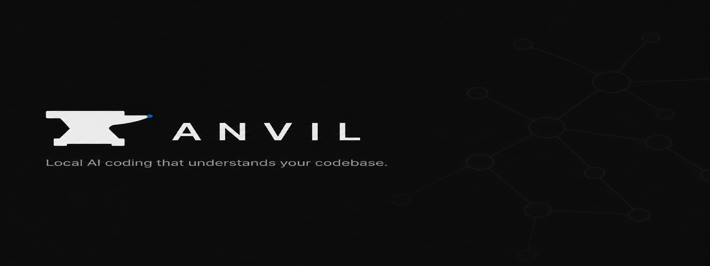
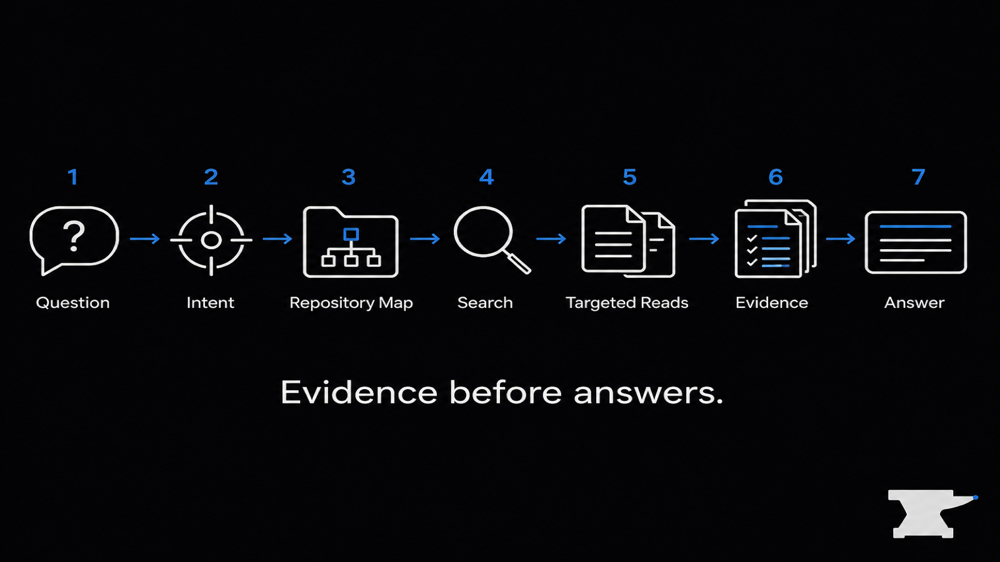

# Anvil

### Local AI coding that understands your codebase.

[](https://github.com/pranee54/Anvil/actions/workflows/ci.yml)
[](LICENSE)
[](CHANGELOG.md)
[](docs/INSTALL-MACOS.md)
[](docs/LOCAL-AI.md)

**Repository-aware** · **Local-first** · **Ollama** · **Open source**

Anvil is a local-first AI coding IDE built on the Code-OSS / VSCodium ecosystem. It explores your repository, traces relevant implementation, and answers from project evidence instead of guessing from filenames. Local models via [Ollama](https://ollama.com) are a first-class path.

<p align="center">
  
</p>

<p align="center">
  
</p>

<p align="center"><em>Anvil IDE — local AI coding with repository-aware assistance.</em></p>

> **Developer Preview — Build from source.** There is no official prebuilt binary download yet.

---

## Quick Start

### macOS (packaged app from source)

```bash
git clone https://github.com/pranee54/Anvil.git
cd Anvil
npm install
```

Install [Ollama](https://ollama.com), then:

```bash
ollama pull qwen2.5-coder:3b
npm run anvil:package:mac
open dist/Anvil.app
```

If macOS blocks the app: Finder → right-click `Anvil.app` → **Open**. Details: [Install macOS](docs/INSTALL-MACOS.md).

Then:

1. **File → Open Folder…** — try [`demo-project/`](demo-project/)
2. Select **Ollama**
3. Select **`qwen2.5-coder:3b`**
4. Run **Anvil: Test Ollama Connection**
5. Open **Anvil Chat** (`Cmd+L`)
6. Ask: `Explain this project.`

### Windows (development only)

There is **no standalone Windows app** yet. Build packages and run Anvil Agent in an Extension Development Host — see [Install Windows](docs/INSTALL-WINDOWS.md).

---

## Why Anvil?

| | |
|--|--|
| **Repository-aware investigation** | Searches and reads relevant project files before answering codebase questions. |
| **Evidence-grounded answers** | Responses can reference inspected project files and sources when evidence is available. |
| **Local-first AI** | Run supported Ollama models on your machine. |
| **Agent workflows** | Ask, Edit, and Agent modes for different development tasks. |
| **Developer control** | Tool execution follows Anvil’s permission system (`strict` / `ask` / `permissive`). |

Investigation improves grounding; it does not guarantee perfect correctness.

---

## Anvil in Action

<table>
  <tr>
    <td width="33%" valign="top" align="center">
      <br />
      <strong>Ask Mode</strong><br />
      <sub>Repository-aware answers grounded in project files.</sub>
    </td>
    <td width="33%" valign="top" align="center">
      <br />
      <strong>Agent Investigation</strong><br />
      <sub>Trace implementation across the repository before answering.</sub>
    </td>
    <td width="33%" valign="top" align="center">
      <br />
      <strong>Local AI</strong><br />
      <sub>Run supported Ollama coding models locally.</sub>
    </td>
  </tr>
</table>

---

## How Anvil Investigates

For codebase questions, Anvil attempts to gather repository evidence before answering:

<p align="center">
  
</p>

<p align="center"><em>Evidence before answers — investigation improves grounding; it does not guarantee perfect correctness.</em></p>

You may see investigation steps such as searching the codebase, reading files, and citing sources. Depth depends on the question, workspace size, model, and permissions.

---

## Local AI

Anvil does **not** ship Ollama or model weights. Install them separately and connect Anvil to your local server (default `http://127.0.0.1:11434`).

| Provider | Status |
|----------|--------|
| **Ollama** | Recommended · local · **streaming** |
| **OpenAI-compatible** HTTP | Implemented · responses are **not** streamed |
| Anthropic | **Not enabled** (scaffolded only) |
| Gemini | **Not enabled** (scaffolded only) |

### Suggested coding models

| Tier | Model |
|------|--------|
| Light | `qwen2.5-coder:3b` |
| Balanced | `qwen2.5-coder:7b` |
| Larger | `qwen2.5-coder:14b` |

Choose based on your machine’s resources. Full setup: [Local AI](docs/LOCAL-AI.md).

---

## Modes

| Mode | Role |
|------|------|
| **Ask** | Understand and explain without intentionally modifying files. |
| **Edit** | Focused code changes with review (Accept / Reject). |
| **Agent** | Multi-step repository tasks using allowed tools. |

Attach context with `@file`, `@selection`, `@folder`, `@codebase`, `@problems`, and `@git`. Details: [Usage](docs/USAGE.md).

---

## Feature Status

| Feature | Status |
|---------|--------|
| Repository investigation | Available |
| Evidence-grounded answers | Available |
| Ask mode | Available |
| Edit mode | Available |
| Agent mode | Available |
| Ollama | Available |
| OpenAI-compatible endpoint | Available |
| Anthropic | Not enabled |
| Gemini | Not enabled |
| macOS source-built app | Available |
| Windows development workflow | Available |
| Windows packaged app | Planned |
| Signed / notarized macOS distribution | Planned |

---

## Try Anvil Safely

The repo includes [`demo-project/`](demo-project/) — a small Task Board sample for testing repository investigation without opening private code.

Suggested prompts:

- `Explain this project.`
- `How does authentication work?`
- `Find the API implementation.`
- `Find a bug in this project.`

---

## Platform Support

| Platform | What works today |
|----------|------------------|
| **macOS** | Build from source → `dist/Anvil.app` (ad-hoc / unsigned; Gatekeeper may require right-click → Open). |
| **Windows** | Extension Development Host only — **no** standalone download. |
| **Linux** | Not verified — planned. |

---

## Documentation

| Guide | Description |
|-------|-------------|
| [Install macOS](docs/INSTALL-MACOS.md) | Package and launch `Anvil.app` |
| [Install Windows](docs/INSTALL-WINDOWS.md) | Extension Development Host workflow |
| [Local AI](docs/LOCAL-AI.md) | Ollama setup and model tiers |
| [Usage](docs/USAGE.md) | Modes, @ context, permissions |
| [Troubleshooting](docs/TROUBLESHOOTING.md) | Common failures |
| [Development](docs/DEVELOPMENT.md) | Contributor setup |
| [Architecture](docs/ARCHITECTURE.md) | System design |
| [Security](SECURITY.md) | Vulnerability reporting |
| [Contributing](CONTRIBUTING.md) | How to contribute |

---

## Architecture

```text
Code-OSS / VSCodium
        ↓
Anvil Extension
        ↓
    agent-core
   ↙    ↓     ↘
Context Tools Models
              ↓
            Ollama
```

| Path | Role |
|------|------|
| `packages/agent-core` | Orchestrator, investigation, tools, permissions, models |
| `packages/anvil-extension` | Anvil Chat UI, commands, diffs, checkpoints |
| `ide/` | Branding + macOS packaging |
| `demo-project/` | Safe sample workspace |
| `apps/legacy-electron/` | Archived prototype — not the product path |

Details: [Architecture](docs/ARCHITECTURE.md).

---

## Development

```bash
npm install
npm run build:agent
npm run build:extension
npm run typecheck:agent
npm run typecheck:extension
npm test
```

See [Development](docs/DEVELOPMENT.md) and [Contributing](CONTRIBUTING.md).

---

## Contributing

Issues and feature requests are welcome via [GitHub Issues](https://github.com/pranee54/Anvil/issues).

- [CONTRIBUTING.md](CONTRIBUTING.md) — setup, style, PR expectations
- [SECURITY.md](SECURITY.md) — report vulnerabilities privately when possible

Keep Anvil-specific logic in `packages/agent-core` and `packages/anvil-extension`.

---

## Security

Report vulnerabilities per [SECURITY.md](SECURITY.md). Do not paste API keys, tokens, or private user data into public issues.

---

## License

Anvil-owned code: [MIT](LICENSE).

Packaged desktop builds redistribute a Code-OSS / VSCodium-derived IDE. See [THIRD_PARTY_NOTICES.md](THIRD_PARTY_NOTICES.md).
